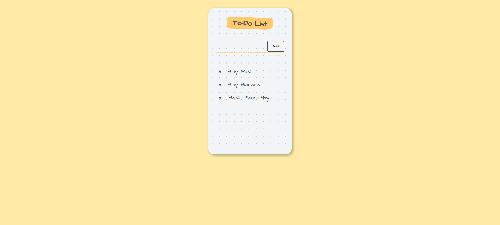

# To Do List

Welcome to the To Do List project repository! This project is a simple and interactive to-do list application built with React and Vite. Users can add new to-do items and remove them by clicking on the item.

## Technologies Used

- React
- Vite
- HTML
- CSS
- JavaScript

## Preview

Here's a preview of the To Do List website:



## Features

- Add new to-do items.
- Remove (delete) to-do items by clicking on them.

## Installation

To run the To Do List application locally, follow these steps:

1. **Clone the repository:**

   ```bash
   git clone https://github.com/Utkarsh1244p/To-Do-List.git

1. **Clone the repository:**

   ```bash
   git clone https://github.com/yourusername/todo-list.git

2. **Navigate into the project directory:**

   ```bash
   cd To-Do-List

3. **Install the dependencies:**

   ```bash
   npm install

4. **Run the application:**

   ```bash
   npm run dev

4. **Clone the repository:**

   ```bash
   git clone https://github.com/yourusername/todo-list.git

5. **Open your browser and navigate to the provided local server URL (usually 'http://localhost:5173' by default or go to URL that is shown in terminal) to view the website.**
